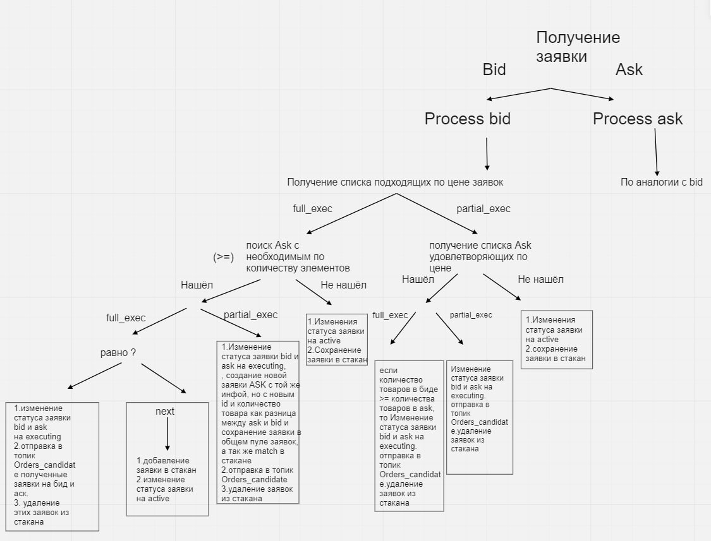

# Микросервис заявок

## Status

Предложение

## Context

Необходимо реализовать микросервис лимитных заказов на продажу (аск) и покупку (бид) в соотвествии со  следующими требованиями:
+ [Требования по созданию лимитной заяки аск (продажу)](https://docs.google.com/document/d/1e60-ou9c1p_JRWwZ613XFqYKoPQC-Yh2iyGsChzqrhU/edit?pli=1#)
+ [Требования по созданию лимитной заявки бид (покупку)](https://docs.google.com/document/d/1ZkI4wA1G_JldqxuCtSxJlWan9AYKG8fxNPMfGt1NUOU/edit#heading=h.erirw953pvj1)

Данный сервис будет заниматься сохранением, валидацией и поиском подходящих для транзакций заявок

## Decision

### <b>Создание нового микросервиса</b>
---
Будет создан один новый микросервис (физически), который будет разделять комманды записи и чтения

### <b>Создание новой заявки</b>
---
Алгоритм работы сервиса
1. Получение запроса на создание новой заявки
2. Сохранение заявки в базу со статусом `validating`
3. Отправка события в Kafka в топик `Order_Created`
4. Получение сообщения из топика `Order_Validation`
5. Если заявка оказалась валидной, то меняем ее статус в базе на `validated`, иначе меняем статус на `aborted` и с ней больше не работаем
6. Если это заявка на покупку, то ищем подходящую заявку на продажу и отправляем сообщение в топик `Order_Candidates` (если заявка нашлась)
7. Отмечаем заявки как выполненные (`executed`)
8. Отправляем событие в топик `Order_Executed`

### <b>Как проходит валидация заявки</b>
---
Все новые заявки кидаются в топик `Order_Created`. Этот топик слушают сервисы баланса и портфеля. Когда эти сервисы получают сообщение, они:
1. Проверяют тип заявки (портфель ничего не делает при получении заявки на покупку, а баланс - при получении заявки на продажу)
2. Проверяют, могут ли заморозить необходимое для заявки кол-во ресурсов
3. Если могут, то морозят и отправляют в топик `Order_Validation` сообщение, что заявка валидна, иначе отправляют сообщение, что заявка невалидна


### <b>Поиск подходящей заявки</b>
---
Далее на схеме представлен алгоритм предоставляющий функциональность стакана



### <b>Общение между сервисами</b>
---
+ <b>Сервис заявок</b> будет принимать запросы на создания заявки по <b>grpc</b> протоколу
+ <b>Сервис заявок</b> будет принимать запросы на чтение по <b>grpc</b>
+ <b>Сервис заявок</b> общается с другими сервисами при помощи <b>Kafka</b>

### <b>Какие методы будут реализованы</b>
---
На фасаде:  
+ Метод создания новой заявки опредленного типа  

На сервисе заявок:
+ Метод создания новой завяки определенного типа
+ Метод получения всех заявок по определенному <b>пользователю</b>
+ Метод получения всех заявок по определенному <b>товару</b>


### <b>Предлагаемый формат хранения заявок в базе</b>
---
```json
"order" : {
    "_id" : "1111-2222",
    "type" : "bid" | "ask",
    "product_id" : "3232-2323",
    "volume" : 1000,
    "price" : 100,
    "full_execution" : true | false,
    "deadline" : "1990-12-1 12:00" | "",
    "investor_id" : "2323-2222",
    "status" : "VALIDATING" | "VALIDATED" | "ACTIVE" | "EXECUTING" | "EXECUTED" | "ABORTED"
}
```

## Consequences
---
1. За счет заморозки активов мы гарантируем, что на момент исполнения заявки у пользователя будет достаточное кол-во продукта (или денег) для ее совершения
2. Сервисы мало связаны между собой, общение происходит только через Kafka