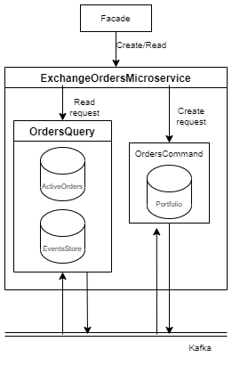

# Микросервис заявок

## Status

Предложение

## Context

Необходимо реализовать микросервис лимитных заказов на продажу (аск) и покупку (бид) в соотвествии со  следующими требованиями:
+ [Требования по созданию лимитной заяки аск (продажу)](https://docs.google.com/document/d/1e60-ou9c1p_JRWwZ613XFqYKoPQC-Yh2iyGsChzqrhU/edit?pli=1#)
+ [Требования по созданию лимитной заявки бид (покупку)](https://docs.google.com/document/d/1ZkI4wA1G_JldqxuCtSxJlWan9AYKG8fxNPMfGt1NUOU/edit#heading=h.erirw953pvj1)

Данный сервис не будет выполнять функции, связанные с исполнением завки бид, прописанные в [требованиях](https://docs.google.com/document/d/1ZkI4wA1G_JldqxuCtSxJlWan9AYKG8fxNPMfGt1NUOU/edit#heading=h.erirw953pvj1), т.к. это выходит за его зону ответственности. За исполнение будет отвечать микросервис транзакций

## Decision

### <b>Создание двух сервисов</b>
---
Микросервис заявок будет поделен на два согласно паттерну CQRS: сервис чтения (OrdersQuery) и сервис комманд (OrdersCommand). Это сделано с целью максимизировать доступность данных, отказоустойчивость и производительность данного сервиса, т.к. он является одним из главнейших сервисов во всей системе

### <b>Принцип работы сервиса комманд (OrdersCommand)</b>
---
Сервис комманд будет принимать запросы на создания заявки определенного типа, проверять возможность создания заявки (проверка портфеля пользователя), создавать на основании полученных данных сообщение и отправлять его в Kafka (если проверка положительная).  
Чтобы проверить возможность создания заявки на сервисе комманд будет существовать "реплика" базы портфеля, которая будет обновляться при получении из Kafka сообщения об изменении портфеля

### <b>Принцип работы сервисы чтения (OrdersQuery)</b>
---
Сервис чтения будет получать сообщения о создании новой заявки из Kafka, создавать и добавлять новую заявку в базу, добавлять запись в базу о создании заявки (EventStore) и отправлять в Kafka сообщение о благополучном создании заявки

### <b>Общение между сервисами</b>
---
+ <b>Сервис комманд</b> будет принимать запросы на создания заявки по <b>grpc</b> протоколу
+ <b>Сервис чтения</b> будет принимать запросы на чтение по <b>grpc</b>
+ <b>Сервис комманд</b> и <b>сервис чтения</b> общаются при помощи <b>Kafka</b>
+ <b>Сервис комманд</b> ходит в сервис портфеля при <b>grpc</b>

### <b>Какие методы будут реализованы?</b>
---
На фасаде:  
+ Метод создания новой заявки опредленного типа  

На сервисе комманд:
+ Метод создания новой завяки определенного типа

На сервисе чтения:
+ Метод получения всех заявок по определенному <b>пользователю</b>
+ Метод получения всех заявок по определенному <b>товару</b>

### <b>Проблема дубликтов сообщений</b>
---
Kafka обеспечивает доставку сообщений <i>al least once</i>, т.е. возможны дубликаты сообщений, нам же критически важно, чтобы такого не было. В качестве решения предлагается генерировать для каждого запроса на создание новой заявки уникальный ID на стороне фасада и передавать его в сообщениях. Сервис чтения будет получать этот ID, проверять, был ли уже такой запрос, и, если не было, выполнять его

### <b>Предлагаемые proto</b>
---
Для запроса на фасад
```protobuf
service OrdersService {
    rpc CreateOrder(CreateOrderRequest) returns (CreateOrderResponse);
}

enum OrderType {
    ASC = 0;
    BID = 1;
}

message DateTime {
    
    int64 sec = 0;

    int32 minute = 1;

    int32 hour = 2;

    int32 day = 3;

    int32 month = 4;

    int32 year = 5;
}

message CreateOrderRequest {
    
    OrdertType type = 1;
    
    string product_id = 2;
    
    double volume = 3;
    
    double price = 4;
    
    bool only_full_execution = 5;

    DateTime deadline = 6;

}


message Success {
    string success_text = 1;
}

message Error {
    
    string error_text = 1;

    string stack_trace = 2;
}

message CreateOrderResponse {
    oneof result {
        Success success = 0;
        Error error = 1;
    }
}
```

Для запроса на сервис комманд
```protobuf
service OrdersService {
    rpc CreateOrder(CreateOrderRequest) returns (CreateOrderResponse);
}

enum OrderType {
    // look above
}

message DateTime {
    // look above
}

message CreateOrderRequest {
    
    OrdertType type = 1;
    
    string product_id = 2;
    
    double volume = 3;
    
    double price = 4;
    
    bool only_full_execution = 5;

    DateTime deadline = 6;

    string order_guid = 7;

    string investor_id = 8;

}

message CreateOrderResponse {
    // look above
}
```

### <b>Схема</b>


## Consequences
---
1. Необходимо будет реализовать 2 сервиса
2. Дублирование данных портфеля на сервисе комманд
3. Возможный рассинхрон данных на сервисе портфеля и сервисе комманд
4. В случаи полного сбоя Kafka мы можем восстановить все активные заявки благодаря EventStore на сервисе чтения
5. Сервис портфеля обязан кидать сообщения об изменении портфеля в Kafka